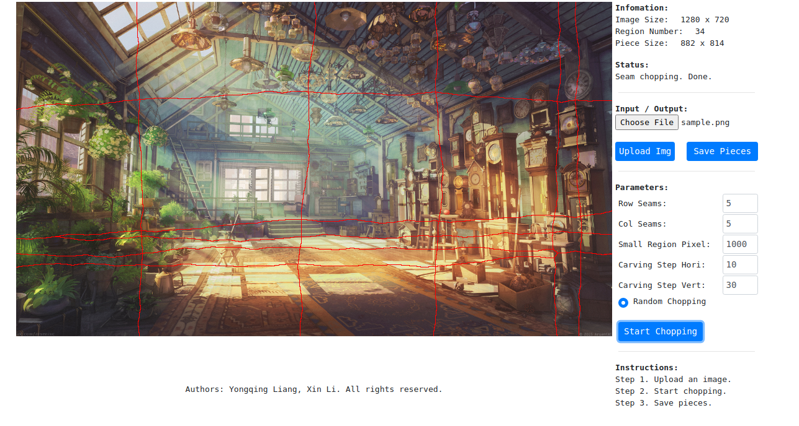
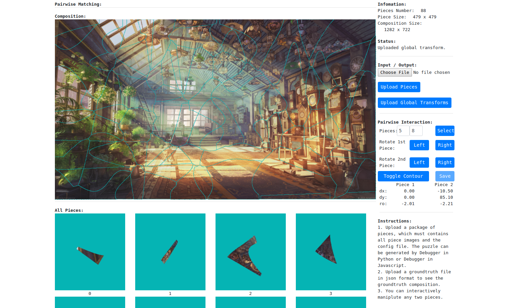

# PuzzleSolving-tool

This is a package containing three tools for puzzle solving:

1. Puzzle Pieces Generator
   - Python based (Support command lines and batch generations).
   - Web based (Use it without installation) [link](https://xmlyqing00.github.io/PuzzleSolving-tool/generator.html)
2. Visualization tool (Web-based Debugger, use it without installation) [link](https://xmlyqing00.github.io/PuzzleSolving-tool/debugger.html)

For automatic puzzle solving (fragmented image reassembly) algorithms, please see our project [webpage](https://www.ece.lsu.edu/xinli/PuzzleSolving/index.html) for more information.

## 1 Puzzle Pieces Generator

### 1.1 Python-based Generator

A tool for generating puzzles. OpenCV-python is required.

Run `python3 generate_puzzle.py -i data/sample.png`.

#### 1.1.1 Optional arguments:

| option | value | description |
| ---- | ---- | ---- |
| -h --help | | show this help message and exit |
| -i | IMG_PATH | Path to the input image. |
| -n | PIECE_N | Number of puzzle pieces. Default is 10. The actual number of puzzle pieces may be different. |
| -t | SAMPLE_N | Number of puzzle you want to generate from the input image. Default is 1. |
| --offset-h | OFFSET_H | Provide the horizontal offset rate when chopping the image. Default is 1. The offset is the rate of the initial rigid piece height. If the value is less than 0.5, no interaction will happen. |
| --offset-w | OFFSET_W | Provide the vertical offset rate when chopping the image. Default is 1. The offset is the rate of the initial piece width. If the value is less than 0.5, no interaction will happen. |
| -s | SMALL_REGION | A threshold controls the minimum area of a region with respect to initial rigid piece area. Default is 0.25. |
| -r | ROTATE | A range of random rotation (in degree) applied on puzzle pieces. Default is 180. The value should be in \[0, 180\]. Each piece randomly select a rotation degree in \[-r, r\] |
| --bg_color | BG_COLOR | Background color to fill the empty area. Default is \[0, 0, 0\]. The type is three uint8 numbers in BGR OpenCV format. |

#### 1.1.2 Output file tree:

```bash
.
├── data
│   ├── puzzles
│   │   ├── 0
│   │   │   ├── config.txt
│   │   │   ├── groundtruth.json
│   │   │   ├── groundtruth.txt
│   │   │   ├── puzzle-0.zip
│   │   │   ├── piece-0.png
│   │   │   ├── piece-1.png
│   │   │   └── ....
│   │   ├── 1
│   │   │   ├── config.txt
│   │   │   ├── groundtruth.json
│   │   │   ├── groundtruth.txt
│   │   │   ├── puzzle-1.zip
│   │   │   ├── piece-0.png
│   │   │   ├── piece-1.png
│   │   │   └── ....
│   │   └── ....
```

#### 1.1.3 File formats:
1. config.txt:
    1. First line: prefix of piece images, is always "piece-".
    2. Second line: number of piece images, one integer.
    3. Third line: bg color for empty areas in BGR OpenCV format.
2. groundtruth.json (used for Debugger in Javascript):
    1. id: piece id.
    2. dx: horizontal translation of the piece.
    3. dy: vertical translation of the piece.
    4. rotation: clockwise rotation of the piece with respect to the center (radius).
3. groundtruth.txt (used for other programs):
  It is the same as the groundtruth.json, the three values per line are: dx, dy, and rotation.
4. puzzle-X.zip (used for Debugger in Javascript):
  A package contains all piece images and the config file. 


### 1.2 Web-based Generator
This is an earlier version. The pieces' shapes may be irregular. If you need semi-regular puzzle pieces, please refer to the python-based generator above.

1. Open the web-based generator [website](https://xmlyqing00.github.io/PuzzleSolving-tool/generator.html). 
2. Choose an image file then click `Upload Img`.
3. Click `Start Chopping` then you can see how the image is cut into pieces.
4. Click `Save Pieces` to save the puzzle pieces.

A screenshot of the web-based generator:


## 2 Visualization tool (Web-based Debugger)

The visualization tool [website](https://xmlyqing00.github.io/PuzzleSolving-tool/debugger.html).

1. Upload pieces in the zip format. The pieces can be generated by the Python-based Generator or the web-based generator.
2. Upload a groundtruth file in json format to see the groundtruth composition.
3. You can interactively manipulate any two pieces and save the results.
 - Click `Select` in the `Pairwise Interaction` section.
 - Left click the piece and drag the piece by mouse.
 - You can rotate the piece by click either `Left` or `Right`.


A screenshot of the visualization tool:


## 3 How to use the generated puzzles

Two sample codes show how to read the generated puzzle into memory and apply the groundtruth on each piece. They are both required OpenCV.

### 3.1 Sample code in Python
```bash
python ./read_puzzle.py
```

### 3.2 Sample code in CPP
```bash
make
./read_puzzle
```

## 4 Citations

If you use our codes or tools in your work. Please cite our paper,
```
JigsawNet: Shredded Image Reassembly Using Convolutional Neural Network and Loop-based Composition.
C. Le and X. Li
IEEE Transactions on Image Processing (TIP), 28(8):4000-4015, 2019.
```

If you use this tool to generate puzzle datasets, please also cite this github page, 
```
@misc{FragmentRepositoryLSUGVC2018,
  title = {Image Puzzle Simulator},
  author = {Yongqing Liang and Xin Li},          
  howpublished = {https://github.com/xmlyqing00/PuzzleSolving-tool},
  year = {2018},
}
``` 